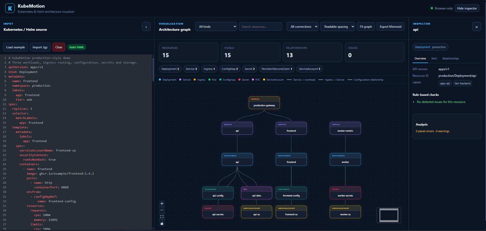

# KubeMotion

KubeMotion is a browser-only Kubernetes and Helm architecture visualizer for exploring complex application manifests without connecting to a live cluster.

It converts Kubernetes YAML or a packaged Helm chart into an interactive, Argo CD-inspired resource view. The application is designed for engineers who want to understand workload relationships, configuration dependencies, service routing, and deployment structure before applying manifests to a cluster.



## Highlights

- **Kubernetes YAML editor** with a scrollable, collapsible CodeMirror interface.
- **Helm chart import** through packaged `.tgz` files directly in the browser.
- **Helm template handling** with safe placeholder processing for common template expressions.
- **Argo CD-inspired tree layout** for a clearer workload-oriented view.
- **Alternative graph layouts** for inspecting broader relationships between resources.
- **Interactive resource nodes** with type-specific colors and selectable details.
- **Relationship visualization** for service routing, ingress routing, workload dependencies, configuration, secrets, storage, and service accounts.
- **Resource search and kind filtering** for large manifests.
- **Resource inspector** showing metadata, labels, normalized YAML, relationships, and detected issues.
- **Rule-based validation** for common deployment problems such as missing probes, incomplete containers, missing selectors, missing service accounts, and mutable image tags.
- **Mermaid export** for sharing architecture diagrams in documentation and pull requests.
- **Compact MiniMap** positioned in the lower-right corner of the canvas.
- **Responsive panel behavior** with a reliable way to reopen the YAML panel and inspector.
- **Browser-only execution**: no Kubernetes cluster credentials or backend service are required.

## Supported resource kinds

KubeMotion recognizes common Kubernetes workload and platform resources, including:

- Deployment
- StatefulSet
- DaemonSet
- ReplicaSet
- Job
- CronJob
- Pod
- Service
- Ingress
- ConfigMap
- Secret
- PersistentVolumeClaim
- ServiceAccount
- Namespace
- Role
- RoleBinding
- ClusterRole
- ClusterRoleBinding
- HorizontalPodAutoscaler
- PodDisruptionBudget
- NetworkPolicy
- ResourceQuota
- LimitRange
- ServiceMonitor
- Custom resources and other unknown kinds are shown using a generic resource representation when possible.

Specialized relationship detection is strongest for common application patterns such as:

- Ingress → Service
- Service → Deployment, StatefulSet, DaemonSet, ReplicaSet, or Pod
- Workload → ConfigMap
- Workload → Secret
- Workload → PersistentVolumeClaim
- Workload → ServiceAccount
- Owner-reference relationships where available

## Getting started

### Requirements

- Node.js 18 or newer
- npm 9 or newer

### Install dependencies

```bash
npm install
```

### Start the development server

```bash
npm run dev
```

Then open the local URL printed by Vite.

### Create a production build

```bash
npm run build
```

### Run tests

```bash
npm test
```

### Preview the production build

```bash
npm run preview
```

## Using KubeMotion

### 1. Paste Kubernetes YAML

Paste one or more YAML documents into the editor. Multi-document input separated by `---` is supported.

### 2. Import a Helm chart

Select **Import .tgz** and choose a packaged Helm chart. KubeMotion reads the archive in the browser, identifies `Chart.yaml`, and loads YAML files from the chart's `templates/` directory.

KubeMotion does not execute Helm or access a cluster. Template expressions are handled conservatively so that the chart can still be inspected visually without running arbitrary template code.

### 3. Select a layout

Use the layout selector to switch between the Argo CD-inspired tree view and broader relationship-oriented layouts.

- Use the tree view for understanding the application structure.
- Use the broader graph view when investigating cross-resource dependencies.

### 4. Inspect resources

Select a resource node to open the inspector. The inspector provides:

- Resource kind and namespace
- API version
- Resource identifier
- Labels and metadata
- Normalized YAML
- Connected resources
- Rule-based warnings

### 5. Filter large charts

Use the kind filter and search field to reduce the visible graph. The resource counters show the total resource count, visible resource count, relationship count, and issue count.

### 6. Export documentation

Use **Export Mermaid** to generate a Mermaid flowchart representation that can be pasted into Markdown documentation, GitHub issues, architecture notes, or design proposals.

## Keyboard shortcuts

| Shortcut | Action |
|---|---|
| `Ctrl + Enter` | Load the example manifest |
| `Ctrl + F` | Fit the graph to the available canvas |
| `Esc` | Close the active inspector or overlay when applicable |

## Project structure

```text
.
├── public/                  # Static public assets
├── src/
│   ├── components/          # Graph nodes, edges, and YAML editor
│   ├── lib/                 # YAML parsing, Helm handling, graph building
│   ├── types/               # Kubernetes and graph type definitions
│   ├── App.tsx              # Main application composition
│   ├── App.css              # Application styling
│   └── index.css            # Global styling
├── docs/
│   └── kubemotion-dashboard.png
├── index.html
├── package.json
└── vite.config.ts
```

## Technology stack

- React
- TypeScript
- Vite
- React Flow
- CodeMirror
- `js-yaml`
- Tailwind CSS through the Vite integration
- Vitest

## Design principles

KubeMotion intentionally focuses on **read-only architecture understanding**. It does not apply resources, execute Helm commands, connect to Kubernetes APIs, or mutate cluster state. This makes it suitable for reviewing manifests locally, preparing documentation, and understanding a chart before deployment.

The visualization uses resource-type colors for fast recognition and a neutral connection style to avoid turning complex dependency graphs into a confusing collection of unrelated edge colors.

## Current limitations

- Helm templates are inspected in the browser and are not fully rendered with Helm values.
- Relationship detection is rule-based and cannot infer every custom controller behavior.
- Custom resources are represented generically unless a known relationship pattern can be detected.
- The visual graph describes manifest relationships; it is not a live cluster state view.
- Large charts may benefit from filtering by namespace, kind, or resource name.

## Development notes

Before submitting changes:

```bash
npm test
npm run build
```

Keep graph layout logic deterministic, avoid overlapping resource cards, and preserve keyboard and mouse accessibility when changing the canvas or panel behavior.

## License

This project is currently intended as a portfolio and educational project. Add a formal license before distributing it as an open-source package.
